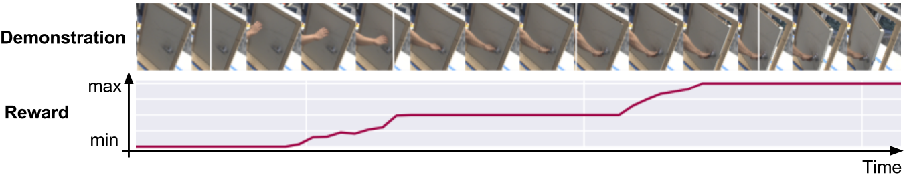
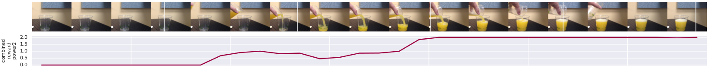
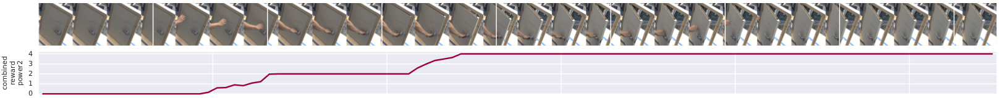
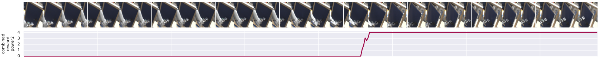

# Unsupervised Perceptual Rewards<br>for Imitation Learning
Pierre Sermanet\*, Kelvin Xu\*†, Sergey Levine<br>
Google Brain<br>
(* equal contribution, † Google Brain Residency program [g.co/brainresidency](https://research.google.com/teams/brain/residency/))

This project is part of the larger [Unsupervised Imitation Learning](https://sermanet.github.io/imitation/) project.

### [[ Paper ]](https://arxiv.org/abs/1612.06699) [[ Dataset ]](https://sites.google.com/site/brainrobotdata/home/pouring-dataset)



##### Abstract
Reward function design and exploration time are arguably the biggest obstacles to the deployment of reinforcement learning (RL) agents in the real world. In many real-world tasks, designing a suitable reward function takes considerable manual engineering and often requires additional and potentially visible sensors to be installed just to measure whether the task has been executed successfully. Furthermore, many interesting tasks consist of multiple steps that must be executed in sequence. Even when the final outcome can be measured, it does not necessarily provide useful feedback on these implicit intermediate steps or sub-goals.
To address these issues, we propose leveraging the abstraction power of intermediate visual representations learned by deep models to quickly infer perceptual reward functions from small numbers of demonstrations. We present a method that is able to identify the key intermediate steps of a task from only a handful of demonstration sequences, and automatically identify the most discriminative features for identifying these steps. This method makes use of the features in a pre-trained deep model, but does not require any explicit sub-goal supervision. The resulting reward functions, which are dense and smooth, can then be used by an RL agent to learn to perform the task in real-world settings.
To evaluate the learned reward functions, we present qualitative results on two real-world tasks and a quantitative evaluation against a human-designed reward function. We also demonstrate that our method can be used to learn a complex real-world door opening skill using a real robot, even when the demonstration used for reward learning is provided by a human using their own hand.
To our knowledge, these are the first results showing that complex robotic manipulation skills can be learned directly and without supervised labels from a video of a human performing the task.

### Unsupervised reward examples





### Learning a task from unsupervised rewards


### Learning Progression


# Citation

```
@inproceedings{SermanetRewards2017, 
    author    = {Sermanet, Pierre and Xu, Kelvin and Levine, Sergey}, 
    title     = {Unsupervised Perceptual Rewards for Imitation Learning}, 
    booktitle = {Proceedings of Robotics: Science and Systems}, 
    year      = {2017}, 
} 
```

# Acknowledgments
We thank Vincent Vanhoucke for helpful discussions and feedback, Mrinal Kalakrishnan and Ali Yahya for indispensable guidance throughout this project and Yevgen Chebotar for his PI^2 implementation. We also thank the anonymous reviewers for their feedback and constructive comments.
